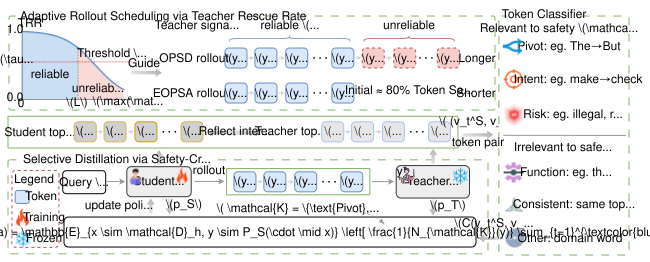
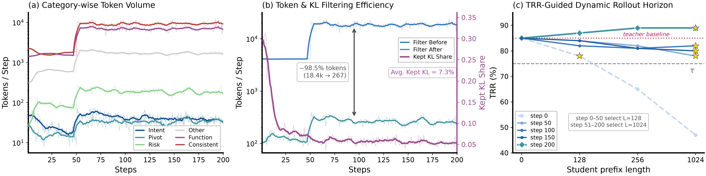
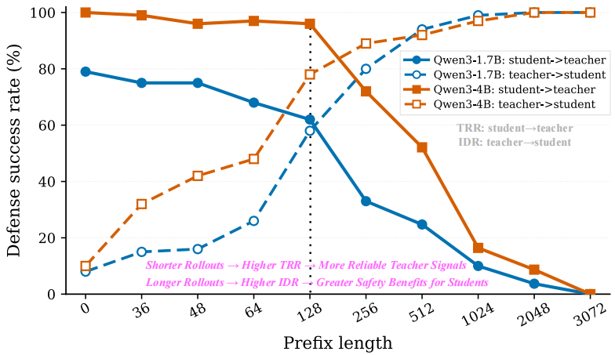
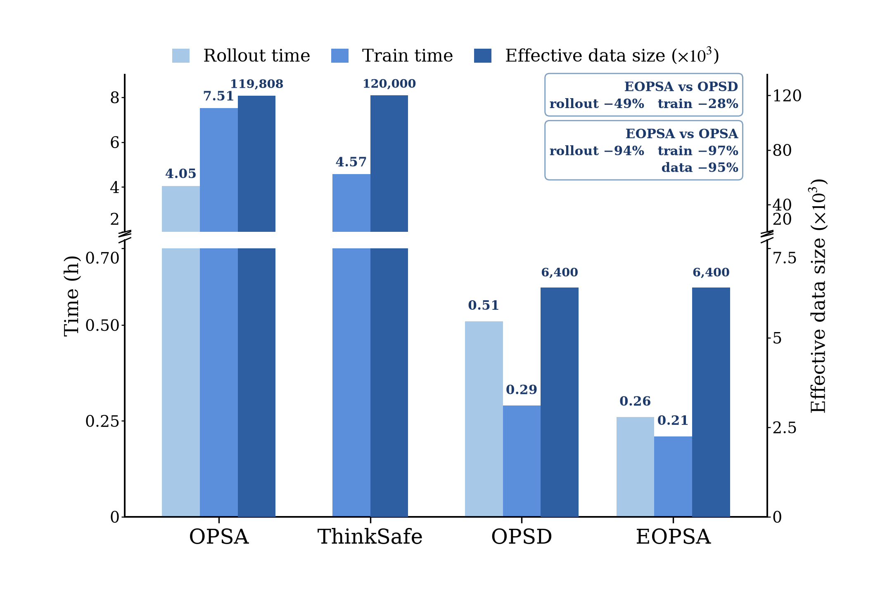
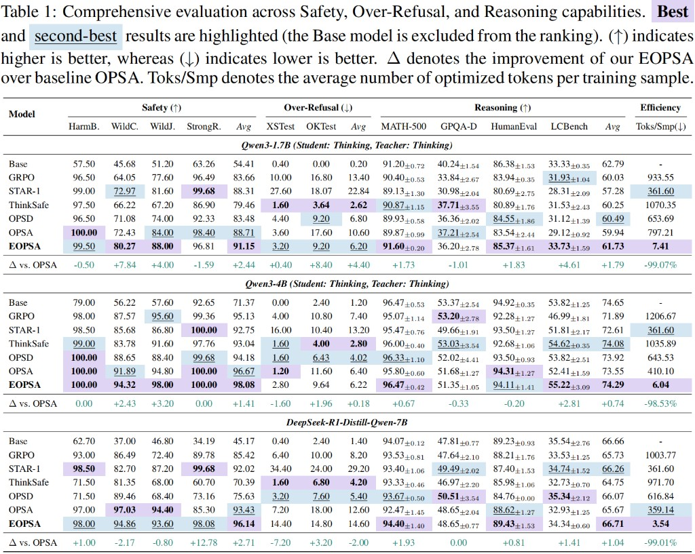

<div align="center">


**Efficient On-Policy Self-Distilled Safety Alignment**

<p align="center">
  <a href="#citation">📄 Paper</a> &nbsp;·&nbsp;
  <a href=".">💻 Code</a> &nbsp;·&nbsp;
  <a href="https://huggingface.co/collections/neuqrui/eopsa">🤗 Model</a>
</p>
</div>

<p align="center">
  
</p>
<p align="center"><em>EOPSA overview: Adaptive Rollout Scheduling truncates the horizon to the reliable TRR regime, and Selective Distillation updates only safety-critical tokens in <code>K = {Pivot, Intent, Risk}</code>.</em></p>

On-policy self-distillation (OPSD) can provide dense, token-level safety supervision, but full-sequence distillation is both expensive and noisy: teacher rescue collapses on long unaligned prefixes, and privileged prompts inject stylistic shifts that dilute genuine safety gradients.

**EOPSA** concentrates the rollout and gradient budget on tokens that are *reliably supervised* and *safety-critical*. It combines Adaptive Rollout Scheduling (ARS) with Selective Distillation, cutting rollout compute by about 50% and backpropagating through about 2% of tokens, while improving safety and retaining reasoning.

<p align="center">
  
</p>
<p align="center"><em>Online training: Selective Distillation keeps a sparse safety-critical subset, while ARS expands the horizon only when Teacher Rescue Rate stays above τ.</em></p>

## Highlights

- **Adaptive Rollout Scheduling.** Student rollouts are bounded by Teacher Rescue Rate (TRR) over candidate horizons `S = {128, 256, 1024}` with threshold `τ = 0.75`, so late-stage tokens are not trained under collapsed teacher supervision.
- **Selective Distillation.** A rubric classifier keeps only `K = {Pivot, Intent, Risk}` and drops safety-neutral stylistic tokens (`Function`, `Consistent`, `Other`).
- **Non-destructive alignment.** Across Qwen3 (1.7B–32B) and DeepSeek-R1-Distill-Qwen-7B, EOPSA improves safety over full-token OPSD while largely preserving MATH / coding / GPQA performance.

<table>
<tr>
<td align="center" valign="top" width="50%">

<br/>
<em>Shorter rollouts keep higher TRR; longer rollouts raise IDR. The crossing near length 128 is the operating trade-off.</em>
</td>
<td align="center" valign="top" width="50%">

<br/>
<em>Wall-clock and data budget versus distillation baselines (Qwen3-1.7B).</em>
</td>
</tr>
</table>

<p align="center">
  
</p>
<p align="center"><em>Main results: EOPSA improves safety over OPSA while using about 1% of the optimized tokens per sample, with reasoning largely preserved.</em></p>

## Method

EOPSA is implemented on a modified [veRL](https://github.com/volcengine/verl) trainer. The paper recipe is the default in `examples/safety_rl/`.

| Paper | Code |
|-------|------|
| Adaptive Rollout Scheduling (ARS) | `ENABLE_ADAPTIVE_ROLLOUT=true` |
| Teacher Rescue Rate `τ` | `data.adaptive_rollout_trr_thresh=0.75` |
| Horizons `S` | `data.adaptive_rollout_prefix_lengths=[128,256,1024]` |
| Selective Distillation | `TOKEN_FILTER=true`, `taxonomy_keep` |
| Safety-critical set `K` | `pivot,intent,risk_wo_same` |
| Forward KL `KL(T \|\| S)` | `DISTILLATION_LOSS_TYPE=topk_forward_kl` |

## Resources

| Resource | Location |
|----------|----------|
| Model weights | [huggingface.co/collections/neuqrui/eopsa](https://huggingface.co/collections/neuqrui/eopsa) |
| Training code | this repository |
| Safety evaluation | [LLM-Safety-Eval](https://github.com/neuqrui/LLM-Safety-Eval) |

Released checkpoints:

- [EOPSA-Qwen3-1.7B](https://huggingface.co/neuqrui/EOPSA-Qwen3-1.7B)
- [EOPSA-Qwen3-4B](https://huggingface.co/neuqrui/EOPSA-qwen3-4B)
- [EOPSA-Qwen3-14B](https://huggingface.co/neuqrui/EOPSA-Qwen3-14B)
- [EOPSA-Qwen3-32B](https://huggingface.co/neuqrui/EOPSA-Qwen3-32B)
- [EOPSA-R1-7B](https://huggingface.co/neuqrui/EOPSA-R1-7B)

## Getting Started

Python 3.10+ and NVIDIA GPUs (paper runs used H200 with FSDP + vLLM).

```bash
conda create -n eopsa python=3.10 -y
conda activate eopsa
pip install -e .
pip install -r requirements.txt
```

```bash
conda activate eopsa
cd examples/safety_rl

CUDA_VISIBLE_DEVICES=0,1 NPROC_PER_NODE=2 \
MODEL_PATH=Qwen/Qwen3-1.7B \
GUARD_MODEL_PATH=meta-llama/Llama-Guard-3-8B \
bash safety_opsd_train.sh
```

The launcher defaults match the paper: ARS on, Selective Distillation on, 200 steps, batch size 32, learning rate `5e-6`, forward KL. More options are documented in [`examples/safety_rl/README.md`](examples/safety_rl/README.md).

| Directory | Area |
|-----------|------|
| `examples/safety_rl/` | Training entry, data, prompts, rewards |
| `examples/safety_rl/token_filter/` | Rubric classifier for Selective Distillation |
| `examples/safety_rl/opsa_scripts/` | Offline lexicon extraction (appendix) |
| `verl/` | Training backend |

Safety / over-refusal evaluation (WildJailbreak, StrongReject, HarmBench, WildChat, XSTest, OKTest) is reproduced with [LLM-Safety-Eval](https://github.com/neuqrui/LLM-Safety-Eval). Point analysis scripts at a local clone with `EVAL_LLM_SAFETY_DIR`.

Do not commit secrets. Copy [`.env.example`](.env.example) and export keys only if you use an API judge or SwanLab.

## License

This repository is released under the Apache License 2.0. It includes a modified copy of [veRL](https://github.com/volcengine/verl). See [`LICENSE`](LICENSE) and the Hugging Face model cards for additional terms.

## Citation

<a id="citation"></a>

```bibtex
@inproceedings{eopsa2027,
  title     = {EOPSA: Efficient On-Policy Self-Distilled Safety Alignment},
  author    = {},
  booktitle = {International Conference on Learning Representations},
  year      = {2027}
}
```

Please also cite [veRL](https://github.com/volcengine/verl) and [SafeChain](https://huggingface.co/datasets/UWNSL/SafeChain).
