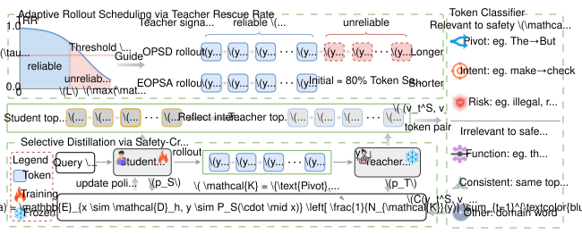
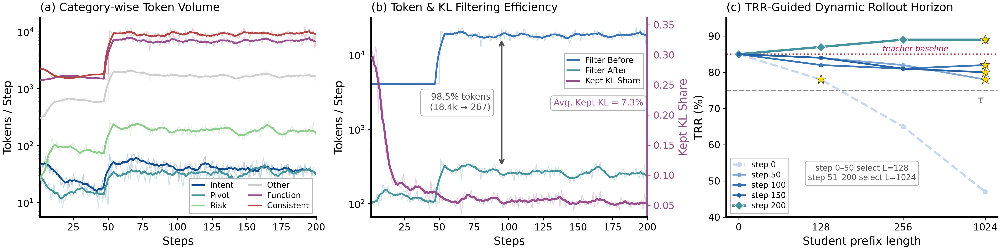
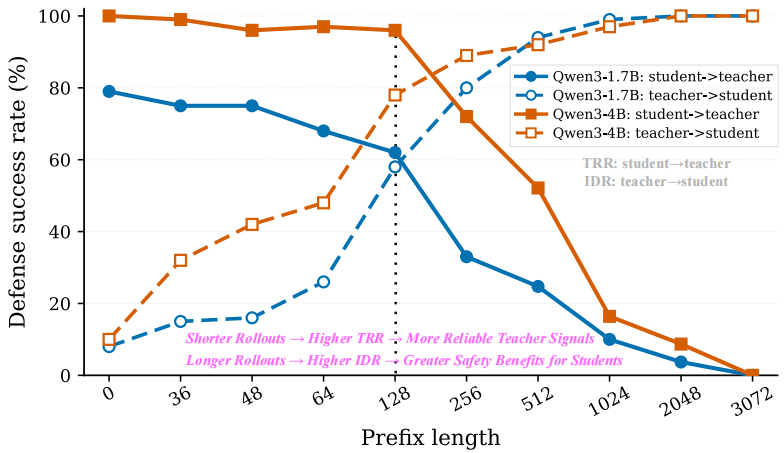
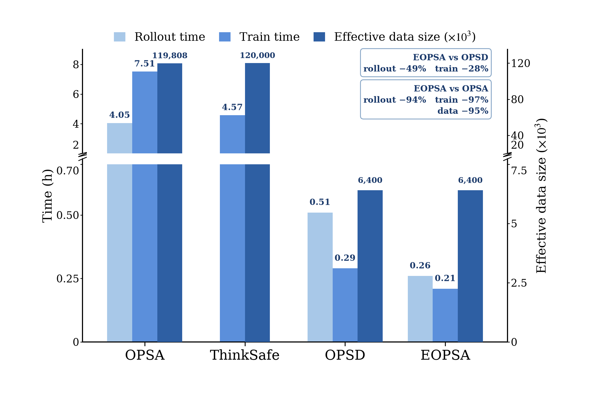
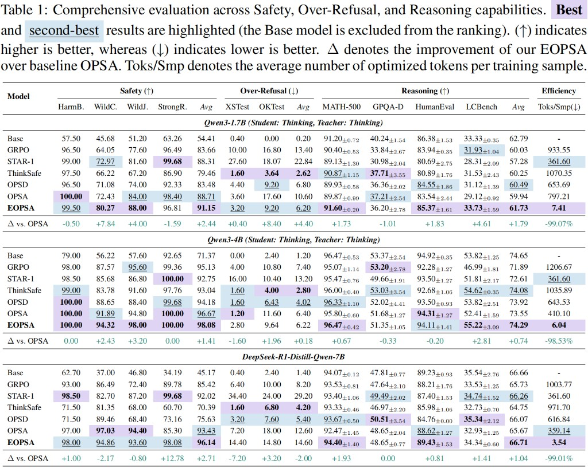

<div align="center">


**Efficient On-Policy Self-Distilled Safety Alignment**

<p align="center">
  <a href="#citation">📄 Paper</a> &nbsp;·&nbsp;
  <a href="."> Code</a> &nbsp;·&nbsp;
  <a href="https://huggingface.co/collections/neuqrui/eopsa"> Models</a>
</p>
</div>

## 💡 Overview

On-policy self-distillation (OPSD) can provide dense, token-level safety supervision, but full-sequence distillation is both expensive and noisy: teacher rescue collapses on long unaligned prefixes, and privileged prompts inject stylistic shifts that dilute genuine safety gradients.

**EOPSA** concentrates the rollout and gradient budget on tokens that are *reliably supervised* and *safety-critical*. It combines Adaptive Rollout Scheduling (ARS) with Selective Distillation, cutting rollout compute by about 50% and backpropagating through about 2% of tokens, while improving safety and retaining reasoning.

## 🧭 Method

<p align="center">
  
</p>
<p align="center"><em>EOPSA overview: Adaptive Rollout Scheduling truncates the horizon to the reliable TRR regime, and Selective Distillation updates only safety-critical tokens in <code>K = {Pivot, Intent, Risk}</code>.</em></p>

<p align="center">
  
</p>
<p align="center"><em>Online training: Selective Distillation keeps a sparse safety-critical subset, while ARS expands the horizon only when Teacher Rescue Rate stays above τ.</em></p>

## ✨ Highlights

- **Adaptive Rollout Scheduling.** Student rollouts are bounded by Teacher Rescue Rate (TRR) over candidate horizons `S = {128, 256, 1024}` with threshold `τ = 0.75`, so late-stage tokens are not trained under collapsed teacher supervision.
- **Selective Distillation.** A rubric classifier keeps only `K = {Pivot, Intent, Risk}` and drops safety-neutral stylistic tokens (`Function`, `Consistent`, `Other`).
- **Non-destructive alignment.** Across Qwen3 (1.7B–32B) and DeepSeek-R1-Distill-Qwen-7B, EOPSA improves safety over full-token OPSD while largely preserving MATH / coding / GPQA performance.

## 📊 Results

<table>
<tr>
<td align="center" valign="top" width="50%">

<br/>
<em>Shorter rollouts keep higher TRR; longer rollouts raise IDR. The crossing near length 128 is the operating trade-off.</em>
</td>
<td align="center" valign="top" width="50%">

<br/>
<em>Wall-clock and data budget versus distillation baselines (Qwen3-1.7B).</em>
</td>
</tr>
</table>

<p align="center">
  
</p>
<p align="center"><em>Main results: EOPSA improves safety over OPSA while using about 1% of the optimized tokens per sample, with reasoning largely preserved.</em></p>

<p align="center"><em>Scaling to Qwen3-14B and Qwen3-32B. Safety stays near ceiling, reasoning stays close to the base model, and EOPSA updates about 9–12 tokens per sample.</em></p>

<table>
<thead>
<tr>
<th rowspan="2">Model</th>
<th colspan="5">Safety (↑)</th>
<th colspan="3">Over-Refusal (↓)</th>
<th colspan="5">Reasoning (↑)</th>
<th>Efficiency</th>
</tr>
<tr>
<th>HarmB.</th><th>WildC.</th><th>WildJ.</th><th>StrongR.</th><th>Avg</th>
<th>XSTest</th><th>OKTest</th><th>Avg</th>
<th>MATH-500</th><th>GPQA-D</th><th>HumanEval</th><th>LCBench</th><th>Avg</th>
<th>Toks/Smp (↓)</th>
</tr>
</thead>
<tbody>
<tr>
<td>Qwen3-14B</td>
<td>84.50</td><td>68.38</td><td>68.00</td><td>97.44</td><td>79.58</td>
<td>0.00</td><td>3.20</td><td>1.60</td>
<td>97.13±0.12</td><td>63.30±1.17</td><td>95.53±0.90</td><td>65.66±3.61</td><td>80.41</td>
<td>–</td>
</tr>
<tr>
<td><b>EOPSA</b></td>
<td><b>100.00</b></td><td><b>97.03</b></td><td><b>99.60</b></td><td><b>99.16</b></td><td><b>98.95</b></td>
<td>4.00</td><td>9.20</td><td>6.60</td>
<td>97.67±0.50</td><td>63.64±1.25</td><td>94.11±1.76</td><td>64.06±3.03</td><td>79.87</td>
<td><b>8.66</b></td>
</tr>
<tr>
<td>Qwen3-32B</td>
<td>73.50</td><td>66.22</td><td>62.40</td><td>93.93</td><td>74.01</td>
<td>0.40</td><td>2.40</td><td>1.40</td>
<td>97.53±0.64</td><td>66.67±1.01</td><td>97.36±0.70</td><td>66.47±1.84</td><td>82.01</td>
<td>–</td>
</tr>
<tr>
<td><b>EOPSA</b></td>
<td><b>100.00</b></td><td><b>98.92</b></td><td><b>100.00</b></td><td><b>100.00</b></td><td><b>99.73</b></td>
<td>4.40</td><td>10.40</td><td>7.40</td>
<td>97.60±0.35</td><td>65.66±1.12</td><td>96.95±1.06</td><td>66.47±2.51</td><td>81.67</td>
<td><b>11.79</b></td>
</tr>
</tbody>
</table>

## ⚙️ Paper Defaults

EOPSA is implemented on a modified [veRL](https://github.com/volcengine/verl) trainer. The paper recipe is the default in `examples/safety_rl/`.

| Paper | Code |
|-------|------|
| Adaptive Rollout Scheduling (ARS) | `ENABLE_ADAPTIVE_ROLLOUT=true` |
| Teacher Rescue Rate `τ` | `data.adaptive_rollout_trr_thresh=0.75` |
| Horizons `S` | `data.adaptive_rollout_prefix_lengths=[128,256,1024]` |
| Selective Distillation | `TOKEN_FILTER=true`, `taxonomy_keep` |
| Safety-critical set `K` | `pivot,intent,risk_wo_same` |
| Forward KL `KL(T \|\| S)` | `DISTILLATION_LOSS_TYPE=topk_forward_kl` |

## 🚀 Quick Start

Python 3.10+ and NVIDIA GPUs (paper runs used H200 with FSDP + vLLM).

```bash
conda create -n eopsa python=3.10 -y
conda activate eopsa
pip install -e .
pip install -r requirements.txt
```

```bash
conda activate eopsa
cd examples/safety_rl

CUDA_VISIBLE_DEVICES=0,1 NPROC_PER_NODE=2 \
MODEL_PATH=Qwen/Qwen3-1.7B \
GUARD_MODEL_PATH=meta-llama/Llama-Guard-3-8B \
bash safety_opsd_train.sh
```

The launcher defaults match the paper: ARS on, Selective Distillation on, 200 steps, batch size 32, learning rate `5e-6`, forward KL. More options are documented in [`examples/safety_rl/README.md`](examples/safety_rl/README.md).

Do not commit secrets. Copy [`.env.example`](.env.example) and export keys only if you use an API judge or SwanLab.

## 📁 Layout

| Directory | Area |
|-----------|------|
| `examples/safety_rl/` | Training entry, data, prompts, rewards |
| `examples/safety_rl/token_filter/` | Rubric classifier for Selective Distillation |
| `examples/safety_rl/opsa_scripts/` | Offline lexicon extraction (appendix) |
| `verl/` | Training backend |

## 🧪 Evaluation

Safety and over-refusal are evaluated with [LLM-Safety-Eval](https://github.com/neuqrui/LLM-Safety-Eval), covering WildJailbreak, StrongReject, HarmBench, WildChat, XSTest, and OKTest. Analysis scripts read that suite from `EVAL_LLM_SAFETY_DIR`.

General reasoning (MATH, coding, and GPQA) is evaluated with [OpenCompass](https://github.com/open-compass/opencompass).

## 📜 License

This repository is released under the Apache License 2.0. It includes a modified copy of [veRL](https://github.com/volcengine/verl). See [`LICENSE`](LICENSE) for additional terms.

## 📚 Citation

<a id="citation"></a>

```bibtex
@misc{eopsa2026,
  title  = {EOPSA: Efficient On-Policy Self-Distilled Safety Alignment},
  author = {},
  year   = {2026}
}
```
